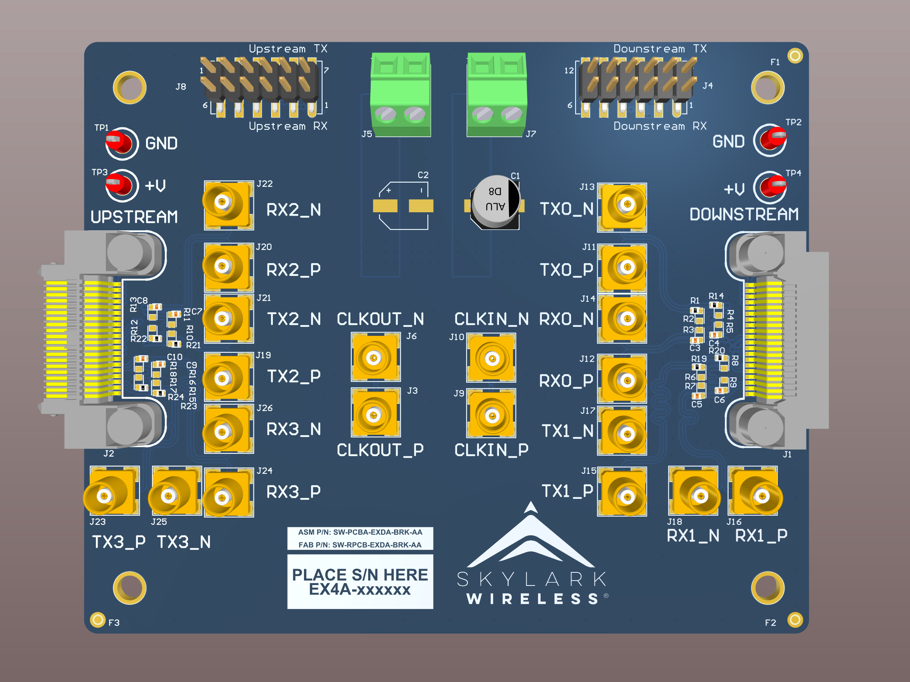

# Iris-EXT-04-BRK Altium Design Project

This design has been manufactured and validated. Please note that silkscreen labels have changed between this library version and the product images presented in these readme files.

## Project
The important directory contents are as follows:
         
      IRIS-EXT-04-BRK.PrjPCB                  - Top-level Altium Designer PCB Project

      IRIS-EXT-04-BRK_outjob.OutJob           - Altium output generation script
	  
## Quick-start Instructions

1. Clone this repository.
1. Install Altium Designer on your machine. You must have a valid license and must use a version greater than 20.0.11.
1. Open the \*.PrjPCB document. This will open all project documents.
1. In the *Projects* tab, expand and double-click on the \*.OutJob. On the right-hand side of the GUI that appears, generate the various outputs. This will produce Gerbers and additional documention in a new */Outputs/* folder in the project directory.

Good luck!
